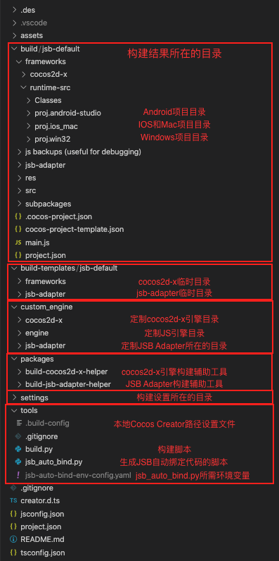
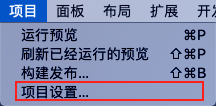
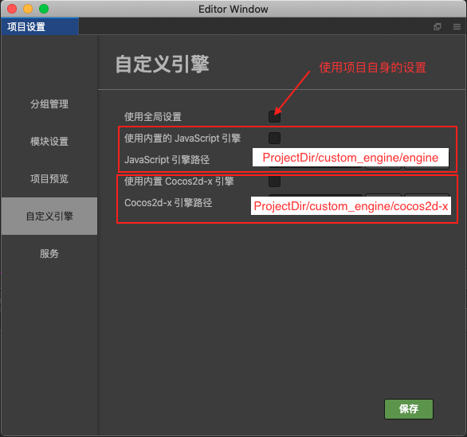
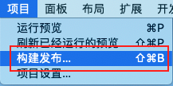
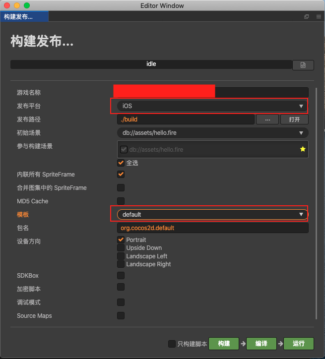

## Cocos Creator Native项目定制引擎及构建流程自动化示例程序

### 项目目录功能说明
项目目录的功能说明，如下图所示：  

### 如何使用
1. 在编辑器的项目中选择项目设置菜单，如下图所示项目  

2. 在项目设置面板，自定义引擎子面板中设置定制的**JS引擎**和**Cocos2d-x引**路径，如下图所示  

3. 在编辑器的项目中选择构建菜单，如下图所示项目  

4. 在构建发布面板中，选择发布平台为IOS，发布模版为default，如下图所示    

5. 在**tools/.build-config**中设置本地的**Cocos Creator**编辑器路径，如果此文件不存在，运行**tools/build.py**脚本会自动添加该文件，也可自行添加，设置内容示例如下所示  
`/Applications/CocosCreator/Creator/2.3.2/CocosCreator.app/Contents/MacOS/CocosCreator`

6. 在**custom_engine**中的**engine**、**cocos2d-x**、**jsb-adapter**目录中进行引擎定制内容开发

7. 在**build/jsb-default/frameworks/runtime-src**中分别进行对应平台的内容开发

8. 在编辑器的**项目/构建发布**面板中进行构建或使用**tools/build.py**进行构建，**tools/build.py**的执行方式如下：  
`python build.py`  
注意：请使用**python2.7**执行命令

### 构建流程
1. 构建初始时先重新生成**JSB自动绑定代码**
2. 构建前，先构建**jsb-adapter**，并将结果置于**build-templates/jsb-default/jsb-adapter**中
3. 构建前同时，拷贝**Cocos2d-x**引擎内容，并将结果置于**build-templates/jsb-default/frameworks**中
4. 再使用**Cocos Creator**的默认构建流程，进行**JS引擎**、**Cocos2d-x引擎**的构建
5. 使用生成的构建内容，进行对应平台的定制开发
6. 使用平台自身的构建流程进行打包发布

### 后续计划
1. 持续添加及完善代码加密，资源压缩，热更新打包等命令
2. 集成**Android/IOS/MAC/Window等平台**的**编译发布**脚本
3. 添加命令行参数支持，方便**CI/CD**工具调用

